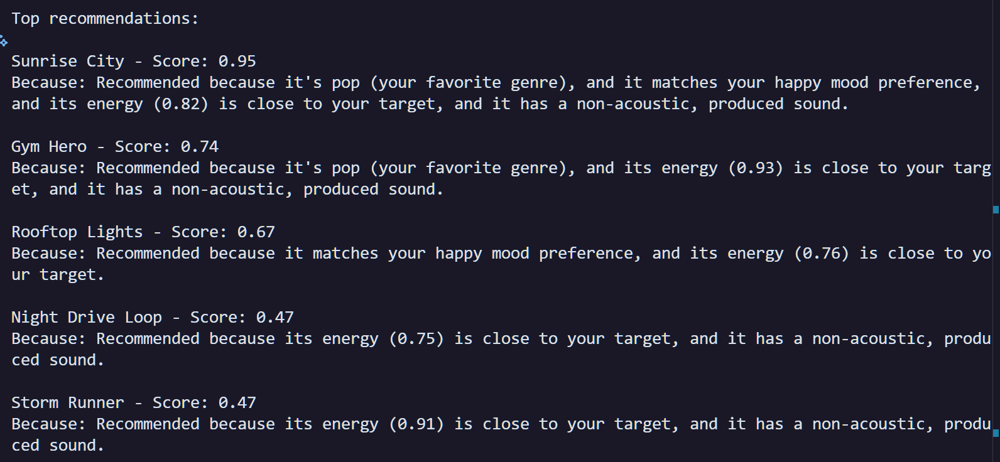
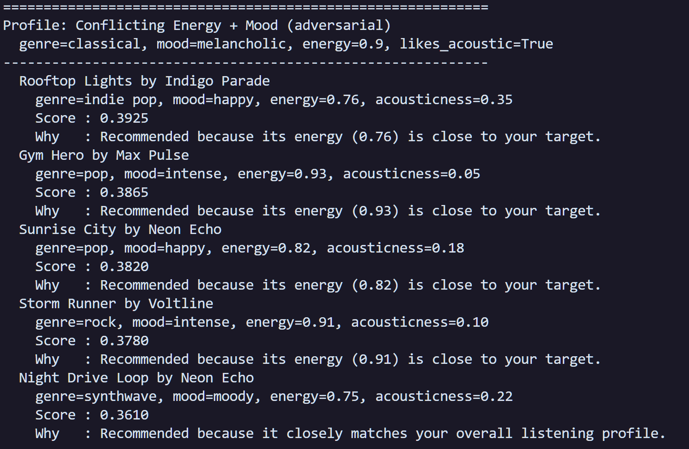

# 🎵 Music Recommender Simulation

## Project Summary

In this project you will build and explain a small music recommender system.

Your goal is to:

- Represent songs and a user "taste profile" as data
- Design a scoring rule that turns that data into recommendations
- Evaluate what your system gets right and wrong
- Reflect on how this mirrors real world AI recommenders

Replace this paragraph with your own summary of what your version does.

---

## How The System Works

Explain your design in plain language.

Some prompts to answer:

- What features does each `Song` use in your system
  - For example: genre, mood, energy, tempo
- What information does your `UserProfile` store
- How does your `Recommender` compute a score for each song
- How do you choose which songs to recommend

Real-world recommenders like Spotify or Apple Music typically combine two strategies: collaborative filtering, which finds patterns across millions of users to surface songs that people with similar taste have enjoyed, and content-based filtering, which looks directly at the features of a song — genre, energy, mood, tempo — and matches them to a user's stated preferences. Collaborative filtering is powerful but requires a lot of behavioral data (which we initially did not begin with) to work well; without it, new users and new songs get stuck in a cold-start problem where the system has nothing to go on. For this simulation, I prioritized content-based filtering because my dataset is small (10 songs) and there is no user interaction history to learn from. My recommender scores each song against a user profile using weighted audio features — giving the most weight to energy proximity and mood match, which tend to cross genre boundaries — and applies a light diversity cap so the results don't collapse into a single genre. This keeps the system transparent and explainable, even if it lacks the discovery power that a collaborative approach would bring at scale.

**Song features used in scoring:**

| Feature | Type | Description |
|---|---|---|
| `genre` | categorical | Musical genre (e.g. pop, lofi, rock) — matched against user's favorite |
| `mood` | categorical | Emotional tone (e.g. happy, chill, intense) — matched against user's preferred mood |
| `energy` | float 0–1 | Intensity and activity level — scored by proximity to user's target |
| `danceability` | float 0–1 | How suitable the track is for dancing — used as a tiebreaker signal |
| `acousticness` | float 0–1 | How acoustic vs. produced the track sounds — matched against user's acoustic preference |

`tempo_bpm` and `valence` are stored on each `Song` object but not used in the current scoring formula — they are available for future experiments.

**UserProfile fields:**

| Field | Type | Description |
|---|---|---|
| `favorite_genre` | string | The genre the user most wants to hear |
| `favorite_mood` | string | The mood or vibe the user is looking for |
| `target_energy` | float 0–1 | The energy level the user wants — songs close to this score higher |
| `likes_acoustic` | bool | Whether the user prefers acoustic tracks over produced/electronic ones |

**Demo output:**



---

## Algorithm Recipe

1. **Collect inputs** — Read the user's taste profile (`favorite_genre`, `favorite_mood`, `target_energy`, `likes_acoustic`) and load every song from `data/new_songs.csv`.

2. **Loop over every song** — For each song in the catalog, compute a score between 0.0 and 1.0 using five weighted signals:

   | Signal | Weight | How it's calculated |
   |---|---|---|
   | Genre match | 25% | 1.0 if genres match, else 0.0 |
   | Mood match | 20% | 1.0 if moods match, else 0.0 |
   | Energy proximity | 30% | `1 - abs(song.energy - target_energy)` |
   | Acousticness fit | 15% | `song.acousticness` if user likes acoustic, else `1 - song.acousticness` |
   | Danceability | 10% | Raw danceability value of the song |

3. **Sort descending** — Rank all songs from highest score to lowest.

4. **Apply diversity filter** — Walk the sorted list and skip any song whose genre already has 2 representatives in the result set. This prevents the top-K from collapsing into a single genre.

5. **Return Top-K** — Stop once K songs have been collected. Return each song with its numeric score and a plain-English explanation of why it was chosen.

---

## Getting Started

### Setup

1. Create a virtual environment (optional but recommended):

   ```bash
   source .venv\Scripts\activate         # Windows

2. Install dependencies

```bash
pip install -r requirements.txt
```

3. Run the app:

```bash
python -m src.main
```

### Running Tests

Run the starter tests with:

```bash
pytest
```

You can add more tests in `tests/test_recommender.py`.

---

## Experiments You Tried

### Experiment 1 — Three distinct normal user profiles

Three profiles were designed to represent clearly different listener types and run through the recommender.

| Profile | Key preferences | Top result | Score |
|---|---|---|---|
| High-Energy Pop | genre=pop, mood=happy, energy=0.88, non-acoustic | Sunrise City | 0.934 |
| Chill Lofi | genre=lofi, mood=chill, energy=0.38, acoustic | Library Rain | 0.928 |
| Deep Intense Rock | genre=rock, mood=intense, energy=0.91, non-acoustic | Storm Runner | 0.951 |

**Findings:**
- When a profile's genre, mood, and energy all agreed with a song in the catalog, the top result scored very high (above 0.90). The system worked exactly as expected for "well-defined" users.
- The diversity cap (max 2 songs per genre) had a visible effect on Chill Lofi: both lofi slots filled immediately, so slots 3–5 were pulled from ambient and jazz — which happened to share the acoustic and low-energy traits but not the exact genre.
- Deep Intense Rock had only one rock song in the catalog ("Storm Runner"), so after rank 1 the recommender fell back on mood=intense and high energy from other genres (pop, synthwave). The genre label mattered less than the feel of the music.


---

### Experiment 2 — Three adversarial / edge-case user profiles

These profiles were designed to expose weaknesses in the scoring logic by giving the algorithm conflicting or impossible signals.

**Profile A — Conflicting Energy + Mood** (`energy=0.9`, `mood=melancholic`, `genre=classical`, `likes_acoustic=True`)

The user wants high-intensity music but a sad emotional tone. No song in the catalog is both high-energy and melancholic.
- The one truly melancholic song, "Copper Cathedral" (classical, energy=0.30), never appeared in the top 5. Its mood matched but its energy was so far from 0.9 that the 30% energy weight buried it completely.
- All five results scored between 0.361 and 0.393 — an unusually tight band. When signals conflict, the algorithm has no clear winner and produces a flat, undifferentiated ranking.
- **Takeaway:** The scoring function cannot balance opposing preferences. It simply averages the signals and returns whatever is "least wrong," which may not be what the user actually wants.



**Profile B — Acoustic EDM Contradiction** (`genre=edm`, `energy=0.97`, `likes_acoustic=True`)

The only EDM track in the catalog, "Bass Drop Kingdom," has acousticness=0.03. Asking for EDM but acoustic is internally contradictory.
- "Bass Drop Kingdom" never appeared in the top 5 at all, despite being the only genre match. Its 25% genre-match bonus was wiped out by the 15% acousticness penalty (0.03 × 0.15 ≈ 0.004 vs 0.97 × 0.15 ≈ 0.145 for an acoustic track).
- The recommender quietly ignored the user's stated genre and surfaced pop and rock songs instead.
- **Takeaway:** The system has no way to tell the user "your preferences are contradictory." It silently returns the best partial match, which could look wrong or confusing to a real user.

**Profile C — No Exact Match in Catalog** (`genre=jazz`, `mood=happy`, `energy=0.9`, `likes_acoustic=False`)

The one jazz track in the catalog ("Coffee Shop Stories") has mood=relaxed and energy=0.37 — almost the opposite of what this profile asks for.
- The jazz track appeared at rank 5 with a score of 0.46, solely because of the 25% genre bonus.
- Ranks 1–4 were all non-jazz songs (pop, indie pop) that better matched mood=happy and energy=0.9.
- **Takeaway:** When genre is a user's stated preference but no song in the catalog delivers on that genre's other traits, the system deprioritizes genre in practice, even though genre carries 25% weight. The 30% energy weight is strong enough to override a genre match if the energy gap is large.

---

### Experiment 3 — Weight shift: energy doubled, genre halved

The scoring weights were changed from the defaults to test how sensitive the ranking is to weight changes.

| Factor | Original | Shifted |
|---|---|---|
| Genre match | 25% | 12.5% |
| Mood match | 20% | 20% |
| Energy proximity | 30% | 60% |
| Acousticness fit | 15% | 15% |
| Danceability | 10% | 10% |

The weights no longer sum to 100% (they sum to 117.5%). Scores are higher overall, but only relative rank matters for evaluating the shift.

**What changed for normal profiles:**
- Rank order was completely stable for all three normal profiles. "Sunrise City," "Library Rain," and "Storm Runner" stayed at #1.
- This happened because, for these profiles, the best song on energy also happened to be the best song on genre. Shifting weight between two signals that agreed didn't change anything.

**What changed for adversarial profiles:**
- **Conflicting Energy + Mood:** The ranking reshuffled significantly. "Gym Hero" (energy=0.93) jumped to #1 over "Rooftop Lights," and "Storm Runner" moved to #2. With energy worth 60%, the algorithm leaned even harder into intensity and ignored the melancholic mood preference almost entirely.
- **Acoustic EDM Contradiction:** Slots 3 and 4 swapped. "Sunrise City" (energy=0.82) overtook "Rooftop Lights" (energy=0.76) because the larger energy weight made the 0.06 energy difference more decisive.
- **No Exact Match:** The most notable change — "Coffee Shop Stories" (the only jazz track, energy=0.37) dropped out of the top 5 entirely. Its genre bonus (now only 12.5%) was no longer enough to compensate for its very low energy. A synthwave track with higher energy took its slot.

**Overall conclusion:** Halving genre and doubling energy made the system more "vibe-driven" and less "genre-loyal." For well-matched profiles the result looked the same. For conflicted or mismatched profiles, the stronger energy weight amplified existing problems — the algorithm became even more dominated by one signal and even less able to respect categorical preferences like mood and genre.

---

## Limitations and Risks

The catalog only contains 10 songs, so the diversity cap and genre-fallback logic are working with almost no room — a user asking for jazz gets one jazz option, and if that song's other traits don't match, the recommender quietly substitutes songs from unrelated genres without any warning. The scoring formula treats all five features as independent and combines them with fixed weights, so it cannot detect or flag contradictory preferences (like wanting high energy and a melancholic mood at the same time) — it simply averages the conflicting signals and returns whatever is "least wrong." Because there is no user interaction history, the system cannot learn or improve over time; it will give the same recommendations to two users with identical profiles even if one of them consistently skips every pop song it surfaces.

---

## Reflection

[**Model Card**](model_card.md)

Building this simulation made it clear how much hidden complexity sits inside a seemingly simple scoring formula. Even with only five features and ten songs, small decisions — like giving energy 30% of the weight or capping genre diversity at two — produced results that were sometimes counterintuitive: a user who asked for jazz ended up with mostly pop, and a user who wanted melancholic music got nothing but high-energy tracks. Those surprises showed that a recommender does not "understand" preferences — it just finds the least-bad numerical compromise, and the outcome depends heavily on how the designer chose to weight the signals.

The adversarial profiles in particular revealed where bias could creep into a real product. If the scoring formula overweights energy — as it did after the weight-shift experiment — the system becomes less responsive to mood and genre, effectively flattening the diversity of recommendations toward whatever audio features dominate the catalog. In a real app serving millions of users, that kind of structural bias could push certain genres or emotional tones to the margins, not because those users are rare but because the formula was never calibrated for them. That is why human judgment still matters even when a model looks "smart": someone has to decide what the weights mean, whose listening habits the catalog reflects, and when a recommendation that scores well numerically is still the wrong answer for the person receiving it.

---
