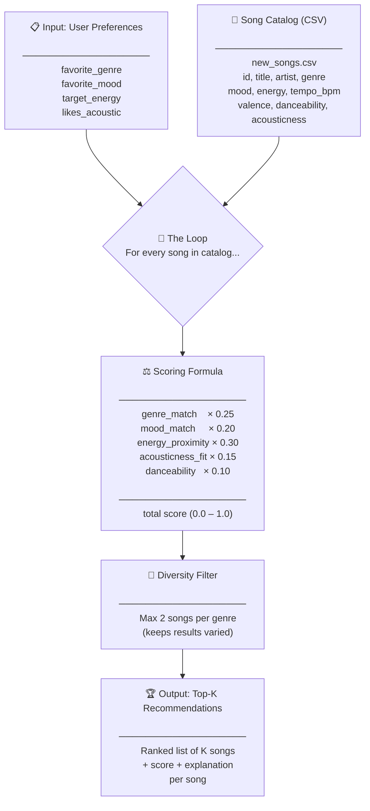

# Music Recommender — Data Flow

```mermaid
flowchart TD
    A["📋 Input: User Preferences
    ───────────────────
    favorite_genre
    favorite_mood
    target_energy
    likes_acoustic"]

    B["📂 Song Catalog (CSV)
    ───────────────────
    new_songs.csv
    id, title, artist, genre
    mood, energy, tempo_bpm
    valence, danceability, acousticness"]

    C{"🔁 The Loop
    For every song in catalog..."}

    D["⚖️ Scoring Formula
    ───────────────────
    genre_match    × 0.25
    mood_match     × 0.20
    energy_proximity × 0.30
    acousticness_fit × 0.15
    danceability   × 0.10
    ───────────────────
    total score (0.0 – 1.0)"]

    E["🔀 Diversity Filter
    ───────────────────
    Max 2 songs per genre
    (keeps results varied)"]

    F["🏆 Output: Top-K Recommendations
    ───────────────────
    Ranked list of K songs
    + score + explanation
    per song"]

    A --> C
    B --> C
    C --> D
    D --> E
    E --> F
```